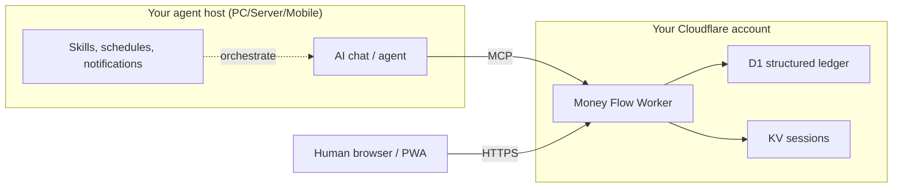

# Money Flow

[License: PolyForm Noncommercial 1.0.0](./LICENSE) · [Stack: Cloudflare Workers · D1 · React](https://workers.cloudflare.com/) · [Interface: MCP](https://modelcontextprotocol.io/)

**Structured tool for AI and human: AI agents/bots operate it through an MCP bridge; Humans use the built-in frontend.**

Track your money exactly how you want. Work with your assets in your favorite AI chat, or see the big picture in a clear visual app. Whether you use a bot or the dashboard, everything stays in sync on one unified ledger.

Money Flow is the structured backend and MCP surface. It does **not** embed an in-app AI. You connect **your** preferred AI chat or agent over MCP to the structured ledger; schedulers and notification channels stay on **your** agent host. Humans use the built-in PWA when they want Pulse, Analytics, Accounts, search, and filters.

**Public demo:** [demo.money-flow.arsols.com](https://demo.money-flow.arsols.com) is a demo, not a production ledger. With `DEMO_MODE=1` each browser session gets its own ledger. Shared D1 does not receive those writes. Passkey enrollment is off. The source code is [PolyForm Noncommercial 1.0.0](./LICENSE).

## Ask once. The ledger updates

Stop typing expenses by hand. In the AI chat you already use:

- Scan a receipt → extract, validate, book through MCP
- “When do I run out?” → forward cash runway from live structured data
- “What’s on the accounts?” → multicurrency / multi-asset summary
- Update FX / add a transfer → same ledger as the UI
- Schedule an agent to watch runway and notify you on Slack, Telegram, WhatsApp, …

Two starter skills ship today (**FX updater**, **receipt processor**). Add any skill you invent — Money Flow stays the structured backend; agents bring the workflow. MCP works without special skills; skills extend complex and repeated workflows.

## Quick start (self-host on your Cloudflare account)

Node.js **20+** is required ([nodejs.org](https://nodejs.org/)).

```bash
git clone https://github.com/arsols-labs/money-flow.git
cd money-flow/app
npm run setup
```

On a TTY the script shepherds **confirm → `npm install` (if needed) → Cloudflare login → setup**, then uses `npx wrangler` from `app/` (no global Wrangler required). It creates D1 + KV on **your** Cloudflare account, writes gitignored `wrangler.local.jsonc`, applies migrations, deploys the Worker + assets, and prints `SESSION_SECRET` and `SETUP_TOKEN` **once** (store both in a password manager; do not share `SESSION_SECRET`).

Then:

1. Open the printed app URL.
2. Enroll a Passkey — paste `SETUP_TOKEN` into the password field on `/setup/passkey` (or the login screen). Do **not** put the token in a `?token=` URL.
3. Connect MCP from your AI chat / agent host to the printed `/mcp` URL (HTTP 401 without a token is expected).
4. Import the FX and receipt skills (or write your own).

### Useful setup flags

```bash
npm run setup -- --help
npm run setup -- --yes --dry-run
npm run setup -- --yes --name money-flow --hostname-mode workers-dev
npm run setup -- --yes --hostname-mode custom --hostname app.example.com
npm run setup -- --yes --seed-demo
npm run setup -- --yes --no-seed-demo
npm run setup -- --yes --rotate-secrets
npm run setup -- --delete my-worker --yes --dry-run
npm run setup -- --delete my-worker --yes
```

| Flag | Meaning |
|------|---------|
| `--yes` / `-y` | Non-interactive. Fails closed if deps are missing (`npm install`) or Wrangler is not logged in (`npx wrangler login`). |
| `--dry-run` | Plan only: no Cloudflare writes, no deploy, no secret upload, no seed. Still may list account resources read-only. |
| `--hostname-mode workers-dev \| custom` | Hosting mode; `custom` needs `--hostname`. |
| `--seed-demo` / `--no-seed-demo` | Optional stranger-safe English showcase seed (default: empty instance). |
| `--rotate-secrets` | Replace `SESSION_SECRET` and `SETUP_TOKEN` and print the new values once. |
| `--delete [worker]` | Tear down **one** self-hosted install (that Worker + owned D1/KV + matching gitignored local config). Live TTY types the Worker name to confirm; `--dry-run` prints the plan and exits 0; `--yes` is for CI. |

Re-running setup is safe: existing D1/KV/Worker names are reused. Seeded demo data can be wiped later from the app (Data → Reset).

### How to connect

Paste your Worker MCP URL into a Custom Connection / Plugin (then Allow), for example:

```
https://your-money-flow.workers.dev/mcp
```

Example client config (package name may change as the public tree rolls out):

```json
{
  "mcpServers": {
    "money-flow": {
      "command": "npx",
      "args": ["-y", "@arsols/money-flow-mcp", "--url", "https://your-money-flow.workers.dev"]
    }
  }
}
```

## For Humans (built-in frontend)

A modern PWA (install from the browser, no app store):

- **Pulse** — forward runway and upcoming commitments
- **Analytics** — spend that supports the forecast
- **Accounts** — multicurrency, multi-country picture
- **Search & filters** — when chat is not the right tool
- **Passkey** sign-in for the Human UI
- UI languages: English, Russian, German, French, Spanish, Portuguese, Serbian

Use the app to verify and steer — not to re-enter life transaction by transaction.

## Architecture (short)



AI chat over MCP and the human interface over HTTPS meet on a Cloudflare Worker. D1 holds the structured ledger; KV holds sessions. Skills, schedules, and notifications stay on the agent host.

## License

[PolyForm Noncommercial 1.0.0](./LICENSE). Non-commercial use only. Commercial use needs a separate written agreement.

## Security

See [SECURITY.md](./SECURITY.md). Please report vulnerabilities through GitHub Security Advisories.

## Support

- [**Donate**](https://www.arsols.com/donate) — informal thanks
- [**Sponsor**](https://www.arsols.com/sponsor) — formal sponsorship
- Feedback: [GitHub Discussions](https://github.com/arsols-labs/money-flow/discussions)
- Demo: [demo.money-flow.arsols.com](https://demo.money-flow.arsols.com)
- Commercial / custom setup: [sponsor](https://www.arsols.com/sponsor) or [GitHub Discussions](https://github.com/arsols-labs/money-flow/discussions)

## About

AR Solutions builds structured tools where Humans and AI agents share one clean data surface. Money Flow is that idea applied to real money: banks, cash, and other assets, operated through MCP and verified in a light PWA.
